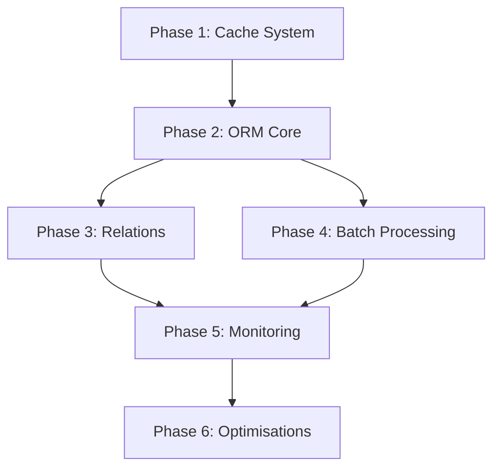

# Plan de Refactorisation Complet MulerTech Database

## 🎯 Vue d'Ensemble

Ce document présente le plan complet de refactorisation du repository MulerTech Database, organisé en phases successives avec détail des classes à créer, modifier ou supprimer.

### Objectifs Principaux

- **Performance** : Réduction de 80% des requêtes DB, amélioration de 60% du temps de réponse
- **Architecture** : Séparation claire des responsabilités, patterns modernes
- **Maintenabilité** : Code PHP 8.3+, PHPStan Level 8, couverture tests 95%+
- **Scalabilité** : Support natif du batch processing et du lazy loading

---

## 📋 Phase 1 : Cache System Unifié (2 semaines)

### Objectif
Créer un système de cache unifié, performant et flexible pour tous les composants.

### 1.1 Interfaces et Base

#### Classes à créer

##### `Cache\CacheInterface`
```php
namespace MulerTech\Database\Cache;

/**
 * Interface principale du système de cache
 * @package MulerTech\Database\Cache
 * @author Sébastien Muler
 */
interface CacheInterface {
    public function get(string $key): mixed;
    public function set(string $key, mixed $value, int $ttl = 0): void;
    public function delete(string $key): void;
    public function clear(): void;
    public function has(string $key): bool;
    public function getMultiple(array $keys): array;
    public function setMultiple(array $values, int $ttl = 0): void;
    public function deleteMultiple(array $keys): void;
}
```

##### `Cache\TaggableCacheInterface`
```php
/**
 * Interface pour les caches avec support des tags
 * @package MulerTech\Database\Cache
 * @author Sébastien Muler
 */
interface TaggableCacheInterface extends CacheInterface {
    public function tag(string $key, array $tags): void;
    public function invalidateTag(string $tag): void;
    public function invalidateTags(array $tags): void;
}
```

##### `Cache\CacheConfig`
```php
/**
 * Configuration du cache
 * @package MulerTech\Database\Cache
 * @author Sébastien Muler
 */
class CacheConfig {
    public function __construct(
        public readonly int $maxSize = 10000,
        public readonly int $ttl = 3600,
        public readonly bool $enableStats = true,
        public readonly string $evictionPolicy = 'lru' // lru, lfu, fifo
    ) {}
}
```

### 1.2 Implémentations Concrètes

#### Classes à créer

##### `Cache\MemoryCache`
- Cache mémoire avec éviction LRU/LFU/FIFO
- Implémentation de `TaggableCacheInterface`
- Support des statistiques de performance
- Gestion automatique de la mémoire

##### `Cache\MetadataCache`
- Hérite de `MemoryCache`
- Optimisé pour les métadonnées d'entités
- Cache permanent (pas d'éviction) pour les mappings
- Sérialisation optimisée des métadonnées

##### `Cache\ResultSetCache`
- Implémentation de `TaggableCacheInterface`
- Sérialisation optimisée des résultats de requêtes
- Support de l'invalidation par table
- Compression automatique des gros résultats

##### `Cache\CacheInvalidator`
- Gestionnaire d'invalidation intelligent
- Tracking des dépendances entre requêtes et tables
- Invalidation en cascade
- Support des patterns d'invalidation

##### `Cache\CacheFactory`
- Factory pour créer les caches appropriés
- Configuration centralisée
- Support de différents backends
- Création lazy des instances

#### Classes à modifier
- `Query\QueryCache` → Implémenter `CacheInterface`
- `Connection\PreparedStatementCache` → Utiliser `MemoryCache`
- `Query\QueryCompiler` → Injecter `CacheInterface`

---

## 📋 Phase 2 : ORM Core - Identity Map & ChangeSet (3 semaines)

### Objectif
Refonte complète du cœur ORM avec Identity Map et gestion optimisée des changements.

### 2.1 Identity Map et Registry

#### Classes à créer

##### `ORM\IdentityMap`
```php
namespace MulerTech\Database\ORM;

/**
 * Map d'identité pour éviter les doublons d'entités
 * @package MulerTech\Database\ORM
 * @author Sébastien Muler
 */
class IdentityMap {
    /** @var array<class-string, array<int|string, WeakReference<object>>> */
    private array $entities = [];
    
    /** @var MetadataCache */
    private readonly MetadataCache $metadataCache;
    
    public function contains(string $class, int|string $id): bool;
    public function get(string $class, int|string $id): ?object;
    public function add(object $entity): void;
    public function remove(object $entity): void;
    public function clear(?string $class = null): void;
    public function getByClass(string $class): array;
}
```

##### `ORM\EntityRegistry`
- Registre global des entités avec métadonnées
- Utilise `SplObjectStorage` pour les références faibles
- Support du garbage collection automatique
- Statistiques d'utilisation

##### `ORM\EntityMetadata`
- Métadonnées immutables d'une entité
- Contient : className, identifier, originalData, state, loadedAt
- Support de la sérialisation
- Cache des propriétés reflection

### 2.2 ChangeSet Manager

#### Classes à créer

##### `ORM\ChangeSetManager`
```php
/**
 * Gestionnaire des modifications d'entités
 * @package MulerTech\Database\ORM
 * @author Sébastien Muler
 */
class ChangeSetManager {
    private readonly IdentityMap $identityMap;
    private readonly EntityRegistry $registry;
    private readonly ChangeDetector $changeDetector;
    
    /** @var SplObjectStorage<object, array<string, Change>> */
    private SplObjectStorage $changeSets;
    
    /** @var array<object> */
    private array $scheduledInsertions = [];
    private array $scheduledUpdates = [];
    private array $scheduledDeletions = [];
    
    public function computeChangeSets(): void;
    public function scheduleInsert(object $entity): void;
    public function scheduleUpdate(object $entity): void;
    public function scheduleDelete(object $entity): void;
    public function commit(): void;
    public function clear(): void;
}
```

##### `ORM\ChangeDetector`
- Détecteur de changements optimisé
- Utilise la comparaison par hash pour les performances
- Support des types complexes (objets, arrays)
- Cache des métadonnées de propriétés

##### `ORM\ChangeSet`
- Représente un ensemble de changements
- Immutable après création
- Support de la sérialisation
- Méthodes de filtrage et transformation

##### `ORM\EntityFactory`
- Factory optimisée pour les entités
- Cache des constructeurs
- Support de l'hydratation sans constructeur
- Optimisation pour les entités simples

### 2.3 State Management avec Enums

#### Classes à créer

##### `ORM\State\EntityState`
```php
namespace MulerTech\Database\ORM\State;

/**
 * États possibles d'une entité
 * @package MulerTech\Database\ORM\State
 * @author Sébastien Muler
 */
enum EntityState: string {
    case NEW = 'new';
    case MANAGED = 'managed';
    case DETACHED = 'detached';
    case REMOVED = 'removed';
    
    public function canTransitionTo(self $state): bool;
    public function isTransient(): bool;
    public function isPersistent(): bool;
}
```

##### `ORM\State\StateTransitionManager`
- Gestionnaire des transitions d'état
- Validation des transitions autorisées
- Hooks pre/post transition
- Support des transitions custom

##### `ORM\State\StateValidator`
- Validateur d'état pour les opérations
- Règles de validation configurables
- Messages d'erreur explicites
- Support des validations async

#### Classes à modifier
- `ORM\EmEngine` → Intégrer IdentityMap + ChangeSetManager
- `ORM\EntityManager` → Utiliser les nouveaux composants
- `ORM\EntityHydrator` → Ajouter cache métadonnées
- `ORM\Engine\EntityState\EntityStateManager` → Migrer vers enum

#### Classes à supprimer
- `ORM\Engine\EntityState\EntityStateManager` (après migration)
- `ORM\Engine\EntityState\EntityChangeTracker` (remplacé par ChangeDetector)

---

## 📋 Phase 3 : Relations & Lazy Loading (3 semaines)

### Objectif
Système de relations optimisé avec lazy loading intelligent et stratégies configurables.

### 3.1 Relation Processors avec Strategy Pattern

#### Classes à créer

##### `Relations\RelationProcessorInterface`
```php
namespace MulerTech\Database\Relations;

/**
 * Interface commune pour tous les processeurs de relations
 * @package MulerTech\Database\Relations
 * @author Sébastien Muler
 */
interface RelationProcessorInterface {
    public function supports(RelationType $type): bool;
    public function load(object $entity, RelationMetadata $metadata): mixed;
    public function persist(object $entity, mixed $value, RelationMetadata $metadata): void;
    public function remove(object $entity, RelationMetadata $metadata): void;
}
```

##### `Relations\RelationType`
```php
/**
 * Types de relations supportées
 * @package MulerTech\Database\Relations
 * @author Sébastien Muler
 */
enum RelationType: string {
    case ONE_TO_ONE = 'one_to_one';
    case ONE_TO_MANY = 'one_to_many';
    case MANY_TO_ONE = 'many_to_one';
    case MANY_TO_MANY = 'many_to_many';
    
    public function isToMany(): bool;
    public function isOwning(): bool;
}
```

##### `Relations\OneToManyProcessor`
- Processeur pour les relations OneToMany
- Support du lazy loading
- Optimisation des requêtes avec JOIN
- Cache des collections

##### `Relations\ManyToManyProcessor`
- Processeur pour les relations ManyToMany
- Gestion optimisée des tables de jointure
- Support des métadonnées additionnelles
- Synchronisation intelligente

##### `Relations\OneToOneProcessor`
- Processeur pour les relations OneToOne
- Détection automatique du côté propriétaire
- Support du lazy loading
- Optimisation avec Identity Map

##### `Relations\RelationProcessorFactory`
- Factory pour créer le bon processeur
- Registration dynamique de processeurs custom
- Cache des instances
- Support de l'injection de dépendances

##### `Relations\LazyLoader`
- Chargement différé intelligent
- Support des proxies transparents
- Batch loading pour éviter N+1
- Integration avec l'Identity Map

##### `Relations\RelationCache`
- Cache spécialisé pour les relations
- Invalidation intelligente
- Support des collections
- Métriques de performance

##### `Relations\JoinTableManager`
- Gestionnaire des tables de jointure
- Opérations batch optimisées
- Support des contraintes
- Synchronisation atomique

### 3.2 Collections Optimisées

#### Classes à créer

##### `Collections\LazyCollection`
```php
namespace MulerTech\Database\Collections;

/**
 * Collection avec chargement différé
 * @package MulerTech\Database\Collections
 * @author Sébastien Muler
 */
class LazyCollection implements Collection, \Countable {
    private bool $initialized = false;
    private ?array $elements = null;
    private readonly \Closure $initializer;
    
    public function initialize(): void;
    public function isInitialized(): bool;
    public function count(): int; // Optimisé pour éviter l'initialisation
}
```

##### `Collections\BatchCollection`
- Collection optimisée pour les opérations batch
- Support du chunking automatique
- Traitement par lots configurables
- Gestion mémoire optimisée

##### `Collections\CachedCollection`
- Collection avec cache intégré
- Invalidation automatique
- Support de la sérialisation
- Métriques de cache

##### `Collections\CollectionFactory`
- Factory pour créer les collections appropriées
- Configuration centralisée
- Support des décorateurs
- Creation lazy

#### Classes à modifier
- `ORM\DatabaseCollection` → Hériter de `LazyCollection`
- `ORM\EntityRelationLoader` → Utiliser `RelationProcessorFactory`
- `ORM\Engine\Relations\RelationManager` → Intégrer les processeurs

#### Classes à supprimer
- `ORM\EntityRelationLoader` (après migration)
- `ORM\Engine\Relations\RelationManager` (après refactoring)

---

## 📋 Phase 4 : Batch Processing & Transactions (2 semaines)

### Objectif
Implémenter un système de batch processing natif avec gestion avancée des transactions.

### 4.1 Batch Operations

#### Classes à créer

##### `Batch\BatchProcessor`
```php
namespace MulerTech\Database\Batch;

/**
 * Processeur principal pour les opérations batch
 * @package MulerTech\Database\Batch
 * @author Sébastien Muler
 */
class BatchProcessor {
    private readonly BatchStrategyResolver $strategyResolver;
    private readonly TransactionManager $transactionManager;
    private readonly PerformanceMonitor $monitor;
    
    public function process(BatchOperation $operation): BatchResult;
    public function processMultiple(array $operations): array;
    public function withTransaction(\Closure $callback): mixed;
}
```

##### `Batch\BatchStrategy`
```php
/**
 * Interface pour les stratégies de batch
 * @package MulerTech\Database\Batch
 * @author Sébastien Muler
 */
interface BatchStrategy {
    public function supports(string $operation): bool;
    public function execute(array $data, array $options = []): BatchResult;
    public function getOptimalBatchSize(array $data): int;
}
```

##### `Batch\InsertBatchStrategy`
- Stratégie pour les INSERT en lot
- Support de `INSERT IGNORE` et `ON DUPLICATE KEY UPDATE`
- Détection automatique de la taille optimale
- Gestion des types de données complexes

##### `Batch\UpdateBatchStrategy`
- Stratégie pour les UPDATE en lot
- Support des UPDATE avec CASE WHEN
- Optimisation pour les mises à jour partielles
- Validation des données avant exécution

##### `Batch\DeleteBatchStrategy`
- Stratégie pour les DELETE en lot
- Support des suppressions conditionnelles
- Optimisation avec IN() pour les IDs
- Gestion des contraintes FK

##### `Batch\ChunkProcessor`
- Processeur de chunks automatique
- Support de la progression
- Gestion mémoire intelligente
- Callbacks pour chaque chunk

##### `Batch\TransactionManager`
- Gestionnaire de transactions pour les batchs
- Support des savepoints
- Transactions imbriquées
- Rollback automatique en cas d'erreur

##### `Batch\BatchResult`
- Résultat d'une opération batch
- Statistiques détaillées
- Gestion des erreurs partielles
- Support de la sérialisation

##### `Batch\BatchOperation`
- Représente une opération batch
- Configuration flexible
- Validation des paramètres
- Support du chaînage

##### `Batch\BatchStrategyResolver`
- Résolution automatique de la stratégie
- Support des stratégies custom
- Cache des résolutions
- Fallback configurable

---

## 📋 Phase 5 : Performance Monitoring & Debug (2 semaines)

### Objectif
Outils de monitoring et debug pour optimiser les performances en production.

### 5.1 Monitoring et Profiling

#### Classes à créer

##### `Debug\PerformanceMonitor`
```php
namespace MulerTech\Database\Debug;

/**
 * Moniteur de performance en temps réel
 * @package MulerTech\Database\Debug
 * @author Sébastien Muler
 */
class PerformanceMonitor {
    private readonly MetricsCollector $metrics;
    private readonly AlertManager $alerts;
    
    public function startQuery(string $sql): string;
    public function endQuery(string $id, float $duration): void;
    public function recordCacheHit(string $type): void;
    public function recordCacheMiss(string $type): void;
    public function getReport(): PerformanceReport;
}
```

##### `Debug\QueryProfiler`
- Profileur de requêtes SQL
- Analyse des plans d'exécution
- Détection des index manquants
- Export des profils

##### `Debug\SlowQueryDetector`
- Détecteur de requêtes lentes
- Seuils configurables
- Suggestions d'optimisation
- Alertes automatiques

##### `Debug\NPlusOneDetector`
- Détecteur du problème N+1
- Analyse des patterns de requêtes
- Suggestions de eager loading
- Rapport détaillé par entité

##### `Debug\CacheHitRateMonitor`
- Moniteur du taux de hit du cache
- Statistiques par type de cache
- Graphiques de tendance
- Alertes sur dégradation

##### `Debug\DebugBar`
- Barre de debug intégrée
- Interface web interactive
- Export des données
- Mode production safe

##### `Debug\MetricsCollector`
- Collecteur central de métriques
- Support de différents backends
- Agrégation temporelle
- Export vers monitoring externe

##### `Debug\AlertManager`
- Gestionnaire d'alertes
- Règles configurables
- Multiple canaux de notification
- Throttling intelligent

##### `Debug\QueryAnalyzer`
- Analyseur avancé de requêtes
- Détection de problèmes communs
- Suggestions d'index
- Score de performance

##### `Debug\PerformanceReport`
- Rapport de performance complet
- Format HTML/JSON/Text
- Graphiques intégrés
- Recommandations

---

## 📋 Phase 6 : Optimisations Finales et Cleanup (1 semaine)

### Objectif
Optimisations avancées et nettoyage du code legacy.

### 6.1 Optimisations Avancées

#### Classes à créer

##### `Optimization\QueryOptimizer`
```php
namespace MulerTech\Database\Optimization;

/**
 * Optimiseur de requêtes avancé
 * @package MulerTech\Database\Optimization
 * @author Sébastien Muler
 */
class QueryOptimizer {
    private readonly QueryAnalyzer $analyzer;
    private readonly IndexSuggester $indexSuggester;
    
    public function optimize(string $sql): string;
    public function suggestIndexes(array $queries): array;
    public function analyzeQueryPlan(string $sql): QueryPlan;
}
```

##### `Optimization\AdvancedConnectionPool`
- Pool de connexions avec load balancing
- Support read/write splitting
- Health checks automatiques
- Failover transparent

##### `Optimization\IndexSuggester`
- Suggéreur d'index intelligent
- Analyse des patterns de requêtes
- Calcul du ROI des index
- Génération de scripts DDL

##### `Optimization\QueryPlan`
- Représentation du plan d'exécution
- Métriques de coût
- Visualisation graphique
- Comparaison de plans

### 6.2 Migration et Nettoyage

#### Classes à supprimer définitivement
1. `ORM\Engine\EntityState\EntityStateManager`
2. `ORM\Engine\EntityState\EntityChangeTracker`
3. `ORM\EntityRelationLoader`
4. `ORM\Engine\Relations\RelationManager`
5. Anciennes classes de cache non conformes

#### Scripts de migration

##### `Migration\MigrationScript`
```php
namespace MulerTech\Database\Migration;

/**
 * Script de migration pour les utilisateurs
 * @package MulerTech\Database\Migration
 * @author Sébastien Muler
 */
class MigrationScript {
    public function migrateEntityManager(): void;
    public function migrateQueryBuilder(): void;
    public function updateConfiguration(): void;
    public function validateMigration(): MigrationReport;
}
```

---

## 📊 Résumé des Modifications

### Total des classes
- **Classes à créer** : 78
- **Classes à modifier** : 12
- **Classes à supprimer** : 5

### Distribution par phase

| Phase | Créations | Modifications | Suppressions |
|-------|-----------|---------------|--------------|
| Phase 1 (Cache) | 10 | 3 | 0 |
| Phase 2 (ORM Core) | 18 | 4 | 2 |
| Phase 3 (Relations) | 16 | 3 | 2 |
| Phase 4 (Batch) | 12 | 0 | 0 |
| Phase 5 (Monitoring) | 10 | 0 | 0 |
| Phase 6 (Optimisations) | 4 | 0 | 1 |

### Dépendances entre phases



### Métriques de succès attendues

- **Performance**
    - Réduction de 80% du nombre de requêtes
    - Amélioration de 60% du temps de réponse
    - Réduction de 40% de l'utilisation mémoire
    - Cache hit rate > 85%

- **Qualité du code**
    - PHPStan Level 8 sans erreur
    - Couverture de tests > 95%
    - Complexité cyclomatique < 10
    - Score SonarQube A

- **Maintenabilité**
    - Documentation API complète
    - Guides de migration
    - Exemples d'utilisation
    - Changelog détaillé

---

## 🚀 Prochaines Étapes

1. **Validation** : Revue du plan avec l'équipe
2. **Priorisation** : Ajustement des priorités si nécessaire
3. **Démarrage** : Commencer par la Phase 1 (Cache System)
4. **Itération** : Revue après chaque phase

Ce plan permet une approche itérative avec des livrables à chaque phase, facilitant le suivi et l'adaptation selon les besoins.