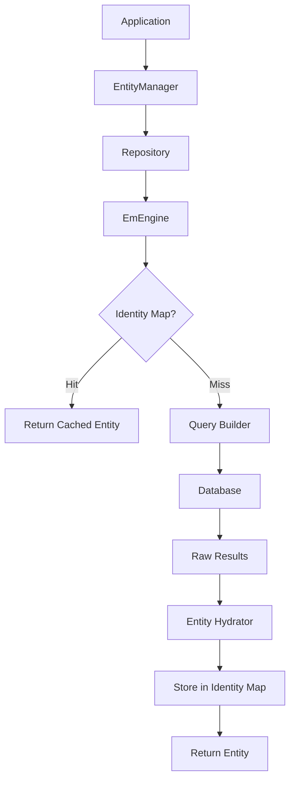
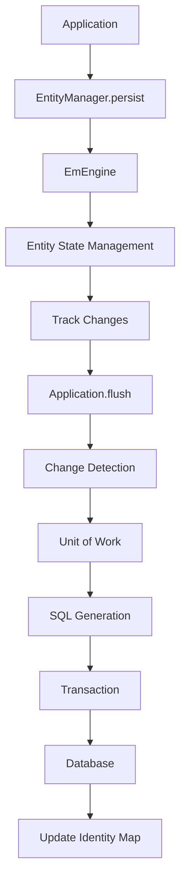
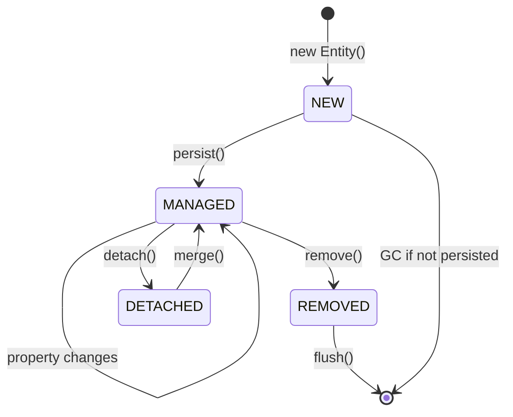
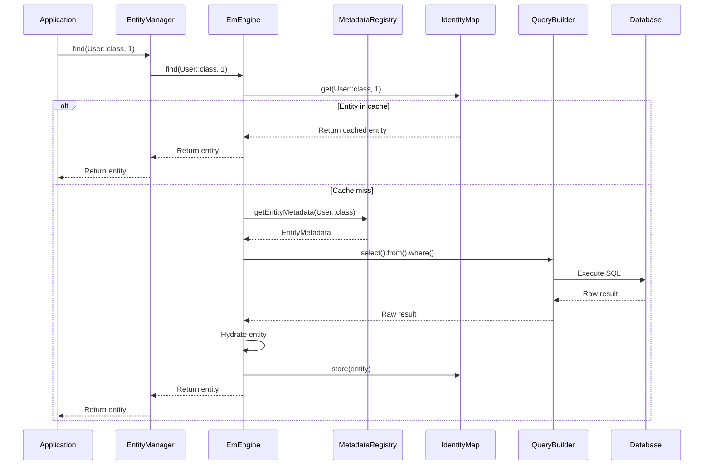

# General Architecture

🌍 **Languages:** [🇫🇷 Français](../../fr/core-concepts/architecture.md) | [🇬🇧 English](architecture.md)

---

## 📋 Table of Contents

- [Overview](#overview)
- [Main Components](#main-components)
- [Data Flow](#data-flow)
- [Architectural Patterns](#architectural-patterns)
- [Entity Lifecycle](#entity-lifecycle)
- [Layers and Responsibilities](#layers-and-responsibilities)
- [Architecture Diagrams](#architecture-diagrams)

---

## Overview

MulerTech Database follows a **layered architecture** inspired by **Domain-Driven Design (DDD)** principles and uses several proven patterns to provide a robust and performant ORM solution.

### 🏗️ Architectural Philosophy

```
┌─────────────────────────────────────────────────────────┐
│                   APPLICATION LAYER                     │
│  ┌─────────────┐  ┌─────────────┐  ┌─────────────┐      │
│  │  Services   │  │ Controllers │  │  Commands   │      │
│  └─────────────┘  └─────────────┘  └─────────────┘      │
└─────────────────────────────────────────────────────────┘
           │                    │                    │
┌─────────────────────────────────────────────────────────┐
│                     DOMAIN LAYER                        │
│  ┌─────────────┐  ┌─────────────┐  ┌─────────────┐      │
│  │  Entities   │  │ Repositories│  │  Events     │      │
│  └─────────────┘  └─────────────┘  └─────────────┘      │
└─────────────────────────────────────────────────────────┘
           │                    │                    │
┌─────────────────────────────────────────────────────────┐
│                   INFRASTRUCTURE LAYER                  │
│  ┌─────────────┐  ┌─────────────┐  ┌─────────────┐      │
│  │EntityManager│  │Query Builder│  │   Cache     │      │
│  └─────────────┘  └─────────────┘  └─────────────┘      │
└─────────────────────────────────────────────────────────┘
           │                    │                    │
┌─────────────────────────────────────────────────────────┐
│                   DATABASE LAYER                        │
│  ┌─────────────┐  ┌─────────────┐  ┌─────────────┐      │
│  │    PDO      │  │   Drivers   │  │ Connections │      │
│  └─────────────┘  └─────────────┘  └─────────────┘      │
└─────────────────────────────────────────────────────────┘
```

### 🎯 Architectural Goals

1. **Separation of concerns**: Each layer has a well-defined role
2. **Loose coupling**: Components are independent
3. **High cohesion**: Related elements are grouped together
4. **Testability**: Architecture facilitating unit testing
5. **Extensibility**: Ability to add new features
6. **Performance**: Optimizations at all levels

---

## Main Components

### 🗄️ EntityManager

The **main entry point** of the ORM, responsible for entity management.

```php
interface EntityManagerInterface
{
    // Entity management
    public function persist(object $entity): void;
    public function remove(object $entity): void;
    public function flush(): void;
    public function clear(): void;
    
    // Retrieval
    public function find(string $class, mixed $id): ?object;
    public function findBy(string $class, array $criteria): array;
    
    // Repositories
    public function getRepository(string $class): EntityRepository;
    
    // Utilities
    public function detach(object $entity): void;
    public function refresh(object $entity): void;
}
```

**Responsibilities:**
- Orchestrate CRUD operations
- Manage the Identity Map
- Coordinate the Unit of Work
- Interface with EmEngine

### ⚙️ EmEngine (Entity Manager Engine)

The **technical core** that implements the ORM business logic.

```php
class EmEngine
{
    private EntityManagerInterface $entityManager;
    private MetadataRegistry $metadataRegistry;
    private IdentityMap $identityMap;
    private ChangeSetManager $changeSetManager;
    private FlushOrchestrator $flushOrchestrator;
    
    public function __construct(
        EntityManagerInterface $entityManager,
        MetadataRegistry $metadataRegistry
    ) {
        $this->entityManager = $entityManager;
        $this->metadataRegistry = $metadataRegistry;
        $this->identityMap = new IdentityMap();
        $this->changeSetManager = new ChangeSetManager();
        $this->flushOrchestrator = new FlushOrchestrator($this);
    }
}
```

**Responsibilities:**
- Entity state management
- Change Detection
- Persistence operation orchestration
- Entity hydration
- Relationship management

### 📊 MetadataRegistry

The **metadata registry** that contains mapping information.

```php
class MetadataRegistry
{
    private array $metadata = [];
    private CacheInterface $cache;
    
    public function registerEntity(string $class): void;
    public function getEntityMetadata(string $class): EntityMetadata;
    public function hasEntity(string $class): bool;
    public function autoRegisterEntities(string $directory): void;
}
```

**Responsibilities:**
- Analyze entity attributes
- Store mapping metadata
- Cache metadata for performance
- Entity validation

### 🔍 Query Builder

The **query builder** with a fluent API.

```php
class QueryBuilder
{
    public function select(string ...$columns): SelectBuilder;
    public function insert(string $table): InsertBuilder;
    public function update(string $table): UpdateBuilder;
    public function delete(string $table): DeleteBuilder;
    public function raw(string $sql): RawQueryBuilder;
}
```

**Responsibilities:**
- Build SQL queries dynamically
- Query validation and security
- Query optimization
- Complex query support

### 🗂️ Repository Pattern

The **Repository pattern** to encapsulate data access logic.

```php
abstract class EntityRepository
{
    protected EntityManagerInterface $entityManager;
    protected string $entityClass;
    
    public function find(mixed $id): ?object;
    public function findAll(): array;
    public function findBy(array $criteria): array;
    public function findOneBy(array $criteria): ?object;
    public function count(array $criteria = []): int;
}
```

---

## Data Flow

### 📥 Read Operations Flow



**Detailed steps:**

1. **Application** makes a request via EntityManager
2. **EntityManager** delegates to appropriate Repository
3. **Repository** checks the Identity Map
4. If **cache miss**, query construction
5. **Execution** of database query
6. **Hydration** of results into entities
7. **Storage** in Identity Map
8. **Return** entity to application

### 📤 Write Operations Flow



**Detailed steps:**

1. **persist()** marks entity for persistence
2. **Tracking** changes in ChangeSet
3. **flush()** triggers synchronization
4. **Detection** of changes (dirty checking)
5. **Planning** operations (Unit of Work)
6. **Generation** of optimized SQL
7. **Execution** within a transaction
8. **Update** caches and metadata

---

## Architectural Patterns

### 🔄 Unit of Work Pattern

Manages modifications as an **atomic unit**.

```php
class FlushOrchestrator
{
    private array $scheduledInserts = [];
    private array $scheduledUpdates = [];
    private array $scheduledDeletes = [];
    
    public function scheduleForInsert(object $entity): void
    {
        $this->scheduledInserts[] = $entity;
    }
    
    public function executeOperations(): void
    {
        $this->executeInserts();
        $this->executeUpdates();
        $this->executeDeletes();
    }
}
```

**Advantages:**
- **Atomicity**: All or nothing
- **Performance**: Batch operations
- **Consistency**: Optimal execution order
- **Rollback**: Cancellation on error

### 🗺️ Identity Map Pattern

**Cache** entities in memory to avoid duplicates.

```php
class IdentityMap
{
    private array $entities = [];
    
    public function add(object $entity): void
    {
        $class = get_class($entity);
        $id = $this->getEntityId($entity);
        $this->entities[$class][$id] = $entity;
    }
    
    public function get(string $class, mixed $id): ?object
    {
        return $this->entities[$class][$id] ?? null;
    }
}
```

**Advantages:**
- **Performance**: Avoids redundant queries
- **Consistency**: Single instance per ID
- **Memory**: Optimized reference management

### 📊 Data Mapper Pattern

**Separation** between object model and database.

```php
class EntityHydrator
{
    public function hydrateEntity(string $class, array $data): object
    {
        $metadata = $this->metadataRegistry->getEntityMetadata($class);
        $entity = new $class();
        
        foreach ($metadata->getColumns() as $column) {
            $value = $this->processValue($data[$column->getColumnName()], $column);
            $this->setProperty($entity, $column->getPropertyName(), $value);
        }
        
        return $entity;
    }
}
```

### 🎯 Repository Pattern

**Encapsulation** of data access logic.

```php
class UserRepository extends EntityRepository
{
    public function findActiveUsers(): array
    {
        return $this->findBy(['isActive' => true]);
    }
    
    public function findByEmail(string $email): ?User
    {
        return $this->findOneBy(['email' => $email]);
    }
}
```

---

## Entity Lifecycle

### 📋 Entity States

```php
enum EntityState
{
    case NEW;        // New entity, not yet persisted
    case MANAGED;    // Entity managed by EntityManager
    case DETACHED;   // Entity detached from context
    case REMOVED;    // Entity marked for removal
}
```

### 🔄 State Transitions



**Transition management:**

```php
class EntityStateManager
{
    private array $entityStates = [];
    
    public function getEntityState(object $entity): EntityState
    {
        return $this->entityStates[spl_object_id($entity)] ?? EntityState::NEW;
    }
    
    public function setEntityState(object $entity, EntityState $state): void
    {
        $this->entityStates[spl_object_id($entity)] = $state;
    }
}
```

---

## Layers and Responsibilities

### 🎨 Application Layer

**Responsibilities:**
- Use case orchestration
- Service coordination
- Business transaction management
- User interface

**Components:**
- Application services
- Commands and handlers
- Controllers (in web context)
- DTOs and transformers

### 🏢 Domain Layer

**Responsibilities:**
- Pure business logic
- Validation rules
- Domain entities
- Business events

**Components:**
- Entities with their logic
- Value Objects
- Domain Services
- Events and Event Handlers

### 🔧 Infrastructure Layer

**Responsibilities:**
- Data persistence
- External service access
- Technical configuration
- Interface implementation

**Components:**
- EntityManager and EmEngine
- Query Builder
- Cache and optimizations
- Database drivers

### 💾 Database Layer

**Responsibilities:**
- Database connections
- Query execution
- Transaction management
- SQL optimizations

**Components:**
- PDO and drivers
- Connection pooling
- Query execution
- Transaction management

---

## Architecture Diagrams

### 🏗️ Component Architecture

```
┌─────────────────────────────────────────────────────────┐
│                    APPLICATION                          │
├─────────────────────────────────────────────────────────┤
│                                                         │
│  ┌─────────────────┐    ┌─────────────────┐             │
│  │   UserService   │    │   BlogService   │             │
│  └─────────────────┘    └─────────────────┘             │
│           │                       │                     │
├───────────┼───────────────────────┼─────────────────────┤
│           │                       │                     │
│  ┌─────────────────┐    ┌─────────────────┐             │
│  │ UserRepository  │    │ PostRepository  │             │
│  └─────────────────┘    └─────────────────┘             │
│           │                       │                     │
│           └───────────┬───────────┘                     │
│                       │                                 │
│              ┌─────────────────┐                        │
│              │ EntityManager   │                        │
│              └─────────────────┘                        │
│                       │                                 │
├───────────────────────┼─────────────────────────────────┤
│                       │                                 │
│              ┌─────────────────┐                        │
│              │    EmEngine     │                        │
│              └─────────────────┘                        │
│                       │                                 │
│  ┌─────────────────┐  │  ┌─────────────────┐            │
│  │  IdentityMap    │  │  │ ChangeSetMgr    │            │
│  └─────────────────┘  │  └─────────────────┘            │
│                       │                                 │
│  ┌─────────────────┐  │  ┌─────────────────┐            │
│  │ QueryBuilder    │  │  │MetadataRegistry │            │
│  └─────────────────┘  │  └─────────────────┘            │
│                       │                                 │
├───────────────────────┼─────────────────────────────────┤
│                       │                                 │
│              ┌─────────────────┐                        │
│              │PhpDatabaseMgr   │                        │
│              └─────────────────┘                        │
│                       │                                 │
│              ┌─────────────────┐                        │
│              │      PDO        │                        │
│              └─────────────────┘                        │
└─────────────────────────────────────────────────────────┘
```

### 🔄 Complete Execution Flow



---

## ➡️ Next Steps

To deepen your understanding:

1. 🔧 [Configuration](configuration.md) - Advanced configuration
2. 💉 [Dependency Injection](dependency-injection.md) - DI integration
3. 🎨 [Mapping Attributes](../entity-mapping/attributes.md) - Detailed mapping
4. 🗄️ [Entity Manager](../orm/entity-manager.md) - Complete API

---

## 🔗 Useful Links

- 🏠 [Back to README](../../README.md)
- 📖 [Complete Documentation](../README.md)
- 🚀 [Quick Start](../quick-start/installation.md)
- 🎯 [Practical Examples](../quick-start/basic-examples.md)
