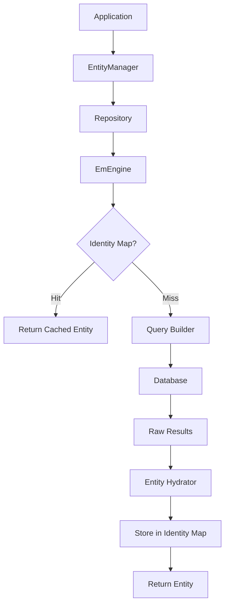
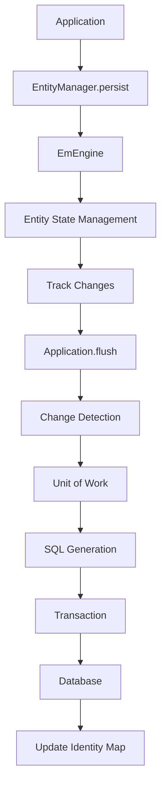
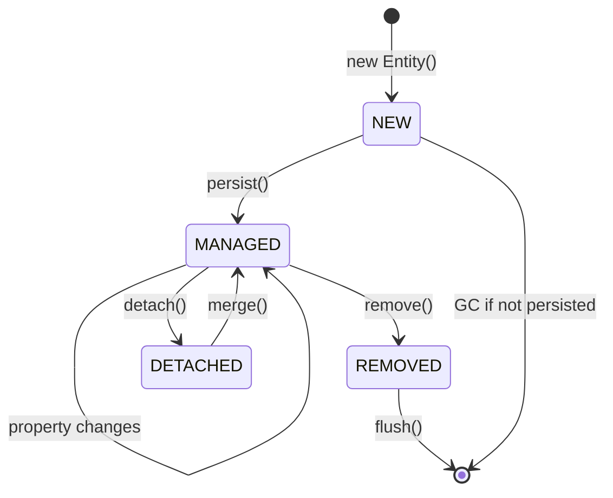
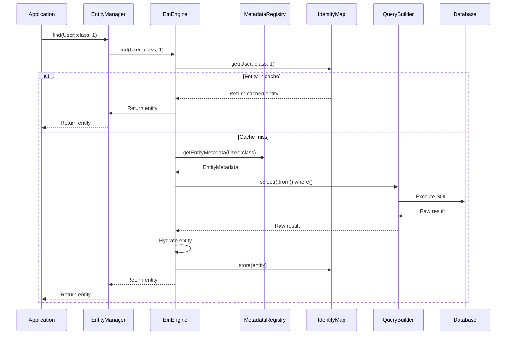

# Architecture Générale

🌍 **Languages:** [🇫🇷 Français](architecture.md) | [🇬🇧 English](../../en/core-concepts/architecture.md)

---


## 📋 Table des Matières

- [Vue d'Ensemble](#vue-densemble)
- [Composants Principaux](#composants-principaux)
- [Flux de Données](#flux-de-données)
- [Patterns Architecturaux](#patterns-architecturaux)
- [Cycle de Vie des Entités](#cycle-de-vie-des-entités)
- [Couches et Responsabilités](#couches-et-responsabilités)
- [Diagrammes d'Architecture](#diagrammes-darchitecture)

---

## Vue d'Ensemble

MulerTech Database suit une **architecture en couches** inspirée des principes **Domain-Driven Design (DDD)** et utilise plusieurs patterns éprouvés pour offrir une solution ORM robuste et performante.

### 🏗️ Philosophie Architecturale

```
┌─────────────────────────────────────────────────────────┐
│                   APPLICATION LAYER                     │
│  ┌─────────────┐  ┌─────────────┐  ┌─────────────┐      │
│  │  Services   │  │ Controllers │  │  Commands   │      │
│  └─────────────┘  └─────────────┘  └─────────────┘      │
└─────────────────────────────────────────────────────────┘
           │                    │                    │
┌─────────────────────────────────────────────────────────┐
│                     DOMAIN LAYER                        │
│  ┌─────────────┐  ┌─────────────┐  ┌─────────────┐      │
│  │  Entities   │  │ Repositories│  │  Events     │      │
│  └─────────────┘  └─────────────┘  └─────────────┘      │
└─────────────────────────────────────────────────────────┘
           │                    │                    │
┌─────────────────────────────────────────────────────────┐
│                   INFRASTRUCTURE LAYER                  │
│  ┌─────────────┐  ┌─────────────┐  ┌─────────────┐      │
│  │ EntityManager│  │Query Builder│  │   Cache     │      │
│  └─────────────┘  └─────────────┘  └─────────────┘      │
└─────────────────────────────────────────────────────────┘
           │                    │                    │
┌─────────────────────────────────────────────────────────┐
│                   DATABASE LAYER                        │
│  ┌─────────────┐  ┌─────────────┐  ┌─────────────┐      │
│  │    PDO      │  │   Drivers   │  │ Connections │      │
│  └─────────────┘  └─────────────┘  └─────────────┘      │
└─────────────────────────────────────────────────────────┘
```

### 🎯 Objectifs Architecturaux

1. **Séparation des responsabilités** : Chaque couche a un rôle bien défini
2. **Faible couplage** : Les composants sont indépendants
3. **Haute cohésion** : Les éléments liés sont regroupés
4. **Testabilité** : Architecture facilitant les tests unitaires
5. **Extensibilité** : Possibilité d'ajouter de nouvelles fonctionnalités
6. **Performance** : Optimisations à tous les niveaux

---

## Composants Principaux

### 🗄️ EntityManager

Le **point d'entrée principal** de l'ORM, responsable de la gestion des entités.

```php
interface EntityManagerInterface
{
    // Gestion des entités
    public function persist(object $entity): void;
    public function remove(object $entity): void;
    public function flush(): void;
    public function clear(): void;
    
    // Récupération
    public function find(string $class, mixed $id): ?object;
    public function findBy(string $class, array $criteria): array;
    
    // Repositories
    public function getRepository(string $class): EntityRepository;
    
    // Utilitaires
    public function detach(object $entity): void;
    public function refresh(object $entity): void;
}
```

**Responsabilités :**
- Orchestrer les opérations CRUD
- Gérer l'Identity Map
- Coordonner le Unit of Work
- Interfacer avec l'EmEngine

### ⚙️ EmEngine (Entity Manager Engine)

Le **cœur technique** qui implémente la logique métier de l'ORM.

```php
class EmEngine
{
    private EntityManagerInterface $entityManager;
    private MetadataRegistry $metadataRegistry;
    private IdentityMap $identityMap;
    private ChangeSetManager $changeSetManager;
    private FlushOrchestrator $flushOrchestrator;
    
    public function __construct(
        EntityManagerInterface $entityManager,
        MetadataRegistry $metadataRegistry
    ) {
        $this->entityManager = $entityManager;
        $this->metadataRegistry = $metadataRegistry;
        $this->identityMap = new IdentityMap();
        $this->changeSetManager = new ChangeSetManager();
        $this->flushOrchestrator = new FlushOrchestrator($this);
    }
}
```

**Responsabilités :**
- Gestion des états d'entités
- Change Detection (détection des modifications)
- Orchestration des opérations de persistance
- Hydratation des entités
- Gestion des relations

### 📊 MetadataRegistry

Le **registre des métadonnées** qui contient les informations de mapping.

```php
class MetadataRegistry
{
    private array $metadata = [];
    private CacheInterface $cache;
    
    public function registerEntity(string $class): void;
    public function getEntityMetadata(string $class): EntityMetadata;
    public function hasEntity(string $class): bool;
    public function autoRegisterEntities(string $directory): void;
}
```

**Responsabilités :**
- Analyser les attributs des entités
- Stocker les métadonnées de mapping
- Cache des métadonnées pour les performances
- Validation des entités

### 🔍 Query Builder

Le **constructeur de requêtes** avec une API fluide.

```php
class QueryBuilder
{
    public function select(string ...$columns): SelectBuilder;
    public function insert(string $table): InsertBuilder;
    public function update(string $table): UpdateBuilder;
    public function delete(string $table): DeleteBuilder;
    public function raw(string $sql): RawQueryBuilder;
}
```

**Responsabilités :**
- Construire des requêtes SQL dynamiquement
- Validation et sécurisation des requêtes
- Optimisation des requêtes
- Support des requêtes complexes

### 🗂️ Repository Pattern

Le **pattern Repository** pour encapsuler la logique d'accès aux données.

```php
abstract class EntityRepository
{
    protected EntityManagerInterface $entityManager;
    protected string $entityClass;
    
    public function find(mixed $id): ?object;
    public function findAll(): array;
    public function findBy(array $criteria): array;
    public function findOneBy(array $criteria): ?object;
    public function count(array $criteria = []): int;
}
```

---

## Flux de Données

### 📥 Flux de Lecture (Read Operations)



**Étapes détaillées :**

1. **Application** fait une demande via EntityManager
2. **EntityManager** délègue au Repository approprié
3. **Repository** vérifie l'Identity Map
4. Si **cache miss**, construction de la requête
5. **Exécution** de la requête en base
6. **Hydratation** des résultats en entités
7. **Stockage** dans l'Identity Map
8. **Retour** de l'entité à l'application

### 📤 Flux d'Écriture (Write Operations)



**Étapes détaillées :**

1. **persist()** marque l'entité pour persistance
2. **Suivi** des modifications dans le ChangeSet
3. **flush()** déclenche la synchronisation
4. **Détection** des changements (dirty checking)
5. **Planification** des opérations (Unit of Work)
6. **Génération** du SQL optimisé
7. **Exécution** dans une transaction
8. **Mise à jour** des caches et métadonnées

---

## Patterns Architecturaux

### 🔄 Unit of Work Pattern

Gère les modifications comme une **unité atomique**.

```php
class FlushOrchestrator
{
    private array $scheduledInserts = [];
    private array $scheduledUpdates = [];
    private array $scheduledDeletes = [];
    
    public function scheduleForInsert(object $entity): void
    {
        $this->scheduledInserts[] = $entity;
    }
    
    public function executeOperations(): void
    {
        $this->executeInserts();
        $this->executeUpdates();
        $this->executeDeletes();
    }
}
```

**Avantages :**
- **Atomicité** : Tout ou rien
- **Performance** : Batch des opérations
- **Cohérence** : Ordre d'exécution optimal
- **Rollback** : Annulation en cas d'erreur

### 🗺️ Identity Map Pattern

**Cache** des entités en mémoire pour éviter les doublons.

```php
class IdentityMap
{
    private array $entities = [];
    
    public function add(object $entity): void
    {
        $class = get_class($entity);
        $id = $this->getEntityId($entity);
        $this->entities[$class][$id] = $entity;
    }
    
    public function get(string $class, mixed $id): ?object
    {
        return $this->entities[$class][$id] ?? null;
    }
}
```

**Avantages :**
- **Performance** : Évite les requêtes redondantes
- **Cohérence** : Une seule instance par ID
- **Mémoire** : Gestion optimisée des références

### 📊 Data Mapper Pattern

**Séparation** entre le modèle objet et la base de données.

```php
class EntityHydrator
{
    public function hydrateEntity(string $class, array $data): object
    {
        $metadata = $this->metadataRegistry->getEntityMetadata($class);
        $entity = new $class();
        
        foreach ($metadata->getColumns() as $column) {
            $value = $this->processValue($data[$column->getColumnName()], $column);
            $this->setProperty($entity, $column->getPropertyName(), $value);
        }
        
        return $entity;
    }
}
```

### 🎯 Repository Pattern

**Encapsulation** de la logique d'accès aux données.

```php
class UserRepository extends EntityRepository
{
    public function findActiveUsers(): array
    {
        return $this->findBy(['isActive' => true]);
    }
    
    public function findByEmail(string $email): ?User
    {
        return $this->findOneBy(['email' => $email]);
    }
}
```

---

## Cycle de Vie des Entités

### 📋 États des Entités

```php
enum EntityState
{
    case NEW;        // Nouvelle entité, pas encore persistée
    case MANAGED;    // Entité gérée par l'EntityManager
    case DETACHED;   // Entité détachée du contexte
    case REMOVED;    // Entité marquée pour suppression
}
```

### 🔄 Transitions d'État



**Gestion des transitions :**

```php
class EntityStateManager
{
    private array $entityStates = [];
    
    public function getEntityState(object $entity): EntityState
    {
        return $this->entityStates[spl_object_id($entity)] ?? EntityState::NEW;
    }
    
    public function setEntityState(object $entity, EntityState $state): void
    {
        $this->entityStates[spl_object_id($entity)] = $state;
    }
}
```

---

## Couches et Responsabilités

### 🎨 Application Layer

**Responsabilités :**
- Orchestration des cas d'usage
- Coordination des services
- Gestion des transactions métier
- Interface avec l'utilisateur

**Composants :**
- Services applicatifs
- Commandes et gestionnaires
- Controllers (dans un contexte web)
- DTOs et transformateurs

### 🏢 Domain Layer

**Responsabilités :**
- Logique métier pure
- Règles de validation
- Entités du domaine
- Événements métier

**Composants :**
- Entités avec leur logique
- Value Objects
- Domain Services
- Events et Event Handlers

### 🔧 Infrastructure Layer

**Responsabilités :**
- Persistance des données
- Accès aux services externes
- Configuration technique
- Implémentation des interfaces

**Composants :**
- EntityManager et EmEngine
- Query Builder
- Cache et optimisations
- Drivers de base de données

### 💾 Database Layer

**Responsabilités :**
- Connexions à la base
- Exécution des requêtes
- Gestion des transactions
- Optimisations SQL

**Composants :**
- PDO et drivers
- Connection pooling
- Query execution
- Transaction management

---

## Diagrammes d'Architecture

### 🏗️ Architecture des Composants

```
┌─────────────────────────────────────────────────────────┐
│                    APPLICATION                          │
├─────────────────────────────────────────────────────────┤
│                                                         │
│  ┌─────────────────┐    ┌─────────────────┐             │
│  │   UserService   │    │   BlogService   │             │
│  └─────────────────┘    └─────────────────┘             │
│           │                       │                     │
├───────────┼───────────────────────┼─────────────────────┤
│           │                       │                     │
│  ┌─────────────────┐    ┌─────────────────┐             │
│  │ UserRepository  │    │ PostRepository  │             │
│  └─────────────────┘    └─────────────────┘             │
│           │                       │                     │
│           └───────────┬───────────┘                     │
│                       │                                 │
│              ┌─────────────────┐                        │
│              │ EntityManager   │                        │
│              └─────────────────┘                        │
│                       │                                 │
├───────────────────────┼─────────────────────────────────┤
│                       │                                 │
│              ┌─────────────────┐                        │
│              │    EmEngine     │                        │
│              └─────────────────┘                        │
│                       │                                 │
│  ┌─────────────────┐  │  ┌─────────────────┐            │
│  │  IdentityMap    │  │  │ ChangeSetMgr    │            │
│  └─────────────────┘  │  └─────────────────┘            │
│                       │                                 │
│  ┌─────────────────┐  │  ┌─────────────────┐            │
│  │ QueryBuilder    │  │  │MetadataRegistry │            │
│  └─────────────────┘  │  └─────────────────┘            │
│                       │                                 │
├───────────────────────┼─────────────────────────────────┤
│                       │                                 │
│              ┌─────────────────┐                        │
│              │PhpDatabaseMgr   │                        │
│              └─────────────────┘                        │
│                       │                                 │
│              ┌─────────────────┐                        │
│              │      PDO        │                        │
│              └─────────────────┘                        │
└─────────────────────────────────────────────────────────┘
```

### 🔄 Flux d'Exécution Complet



---

## ➡️ Étapes Suivantes

Pour approfondir votre compréhension :

1. 🔧 [Configuration](configuration.md) - Configuration avancée
2. 💉 [Injection de Dépendances](dependency-injection.md) - Intégration DI
3. 🎨 [Attributs de Mapping](../../fr/entity-mapping/attributes.md) - Mapping détaillé
4. 🗄️ [Entity Manager](../../fr/orm/entity-manager.md) - API complète

---

## 🔗 Liens Utiles

- 🏠 [Retour au README](../../fr/../README.md)
- 📖 [Documentation Complète](../../fr/README.md)
- 🚀 [Démarrage Rapide](../../fr/quick-start/installation.md)
- 🎯 [Exemples Pratiques](../../fr/quick-start/basic-examples.md)